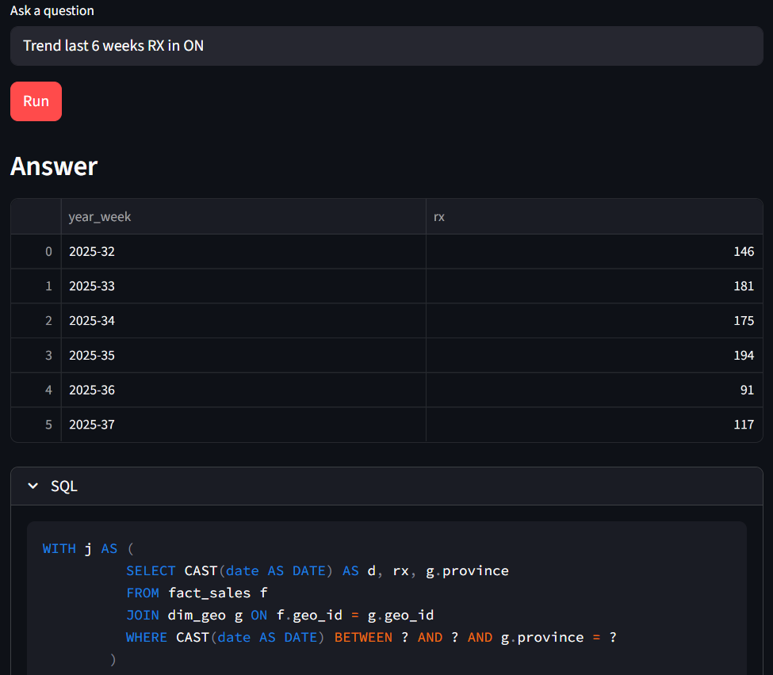
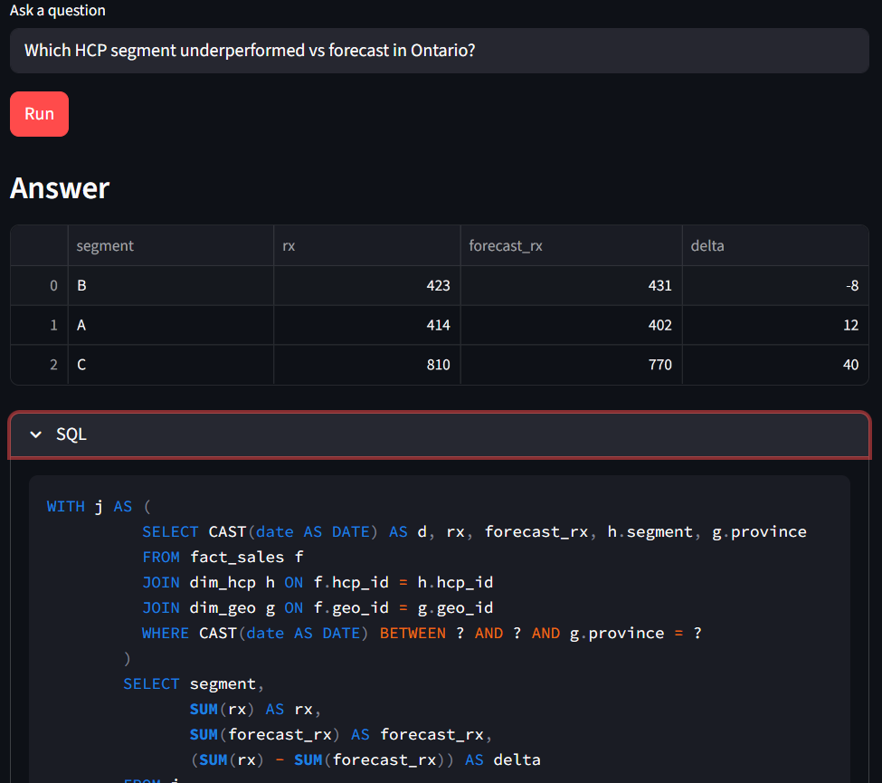
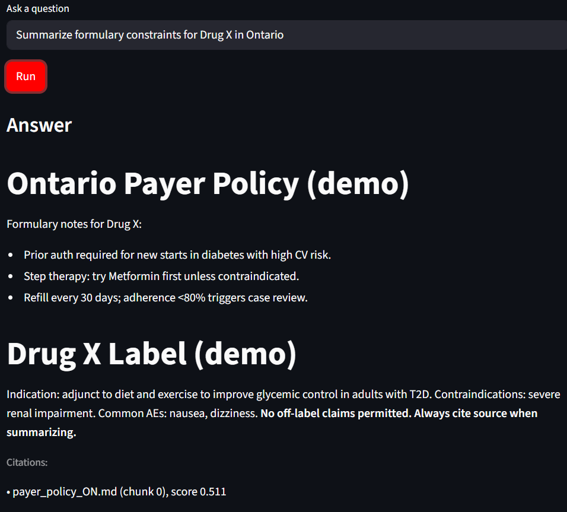
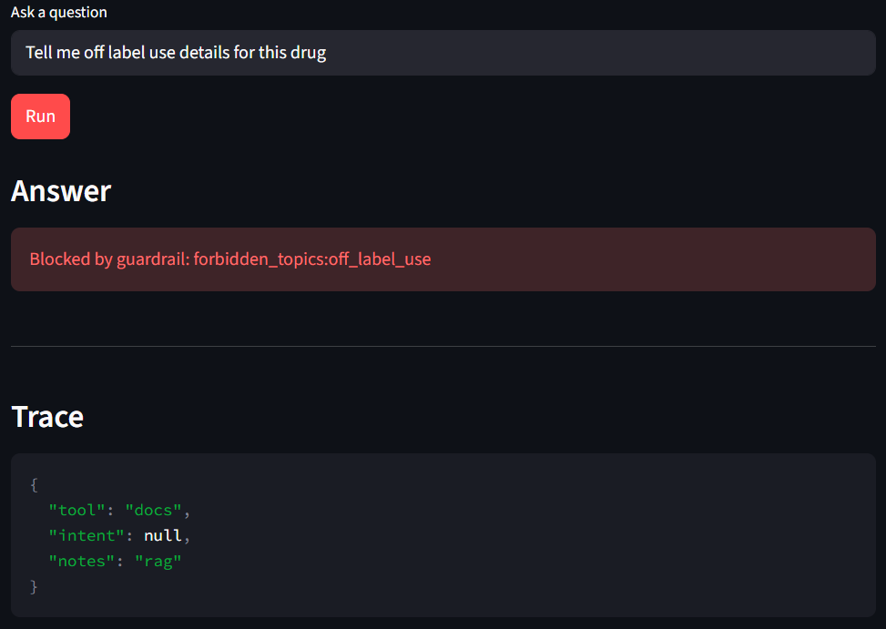

# OmniRx (Omni-channel Agentic Talk-to-Data for Commercial Pharma)


---
## Highlights

- **GenAI & Agentic AI:** Planner routes to two agents (Talk-to-SQL and Docs-RAG) with lightweight orchestration.
- **Commercial use-cases:** 
  1) Omnichannel trends and segment under/over-performance.  
  2) Market access summary from payer policy + label docs with **citations**.  
  3) Talk-to-data: natural-language to SQL over a small commercial star schema.
- **Responsible AI:** Policy in `contracts/policy.yml` with forbidden topics + PII regex; guard blocks off-label + enforces citations.
- **Production-readiness:** Tests (`pytest`), lint (`ruff`), CI (GitHub Actions), FastAPI (`/ask`, `/health`), Streamlit UI, Dockerfile.
- **Data foundations:** Structured (DuckDB views over CSVs) + unstructured (docs/ indexed via FAISS + MiniLM embeddings).
- **Lifecycle:** Small eval harness:
  - **NL→SQL:** `tests/test_eval_nl2sql.py` targets ≥80% pass on 15 prompts.  
  - **Guardrails:** `tests/test_eval_guard.py` blocks negative cases.
- **Cloud-ready:** Containerized; trivial deploy to Cloud Run/ECS later.
---

## Data & docs (demo)
Synthetic star schema in `data/` (`fact_sales`, `dim_hcp`, `dim_geo`, `dim_payer`) and two demo docs in `data/docs/` for RAG. No real patient/HCP data.

## Run the demo UI
```bash
source .venv/bin/activate
streamlit run app/Home.py
```
## Run with Docker
```bash
docker build -t omnix:latest .
docker run --rm -p 8000:8000 omnix:latest
# then:
# curl -X POST localhost:8000/ask -H "content-type: application/json" -d '{"query":"Trend last 4 weeks RX in ON"}'
```

### Run the evaluations
```bash
pytest -q
```

## Screenshots

<p align="center">
  
  
</p>

<p align="center">
  
  
</p>

